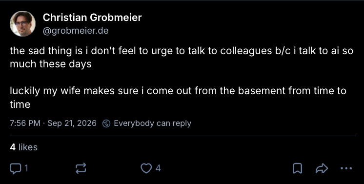

# Talk Outline

## [8m] 1. Intro: The Search for Joy

### BrettCodes is done coding with AI

A while ago, a TypeScript developer called Brett announced on his YouTube channel that he was done coding with AI. He had been a developer for 20 years and had been working with AI agents for over a year. And just like that, he decided to step away from it.
  - His main reason was that he felt AI was taking away the joy he found in coding by hand.
  - Secondary reasons: he didn't care as much about AI-generated code, and he no longer felt the need to optimize bits of tedious code.
  - His conclusion: "I'm done coding with AI, and we'll simply see what happens next."
  - Well, that's one way to deal with it. And a very brave one at that.
  - I mean no disrespect to Brett's decision. I wish him well and I sincerely hope he finds the joy he's looking for.
  - Let me just say it surprised me that this felt like the only way for him to deal with the agentic AI situation. 
  - The video now has over 1M views, so clearly Brett has struck a nerve. 
  - And it got me thinking as well, about my own feelings on the current developments in agentic AI. Don't get me wrong: I share Brett's love of writing code, and I certainly don't love everything about AI. But I think it can also create new opportunities for us. Opportunities that we should at least consider before we conclude that the field has stopped giving us joy altogether.

### Two Types of People in Software Development

What do you enjoy more in software development? 

1. The act of creating something, or;
2. The feeling you get when your creation is appreciated? 

If you're in the second category, you're golden. This current age of agentic AI will probably fit you like a glove. You can produce more software than before and get more praise for it. So go forth and enjoy it! (create a 'Takeaway' looking slide just for fun)

If you're in the first, at the very least you'll have mixed feelings towards the agentic AI movement.
And you're in good company: across the globe, people who work in creative industries such as art, music or movies are standing up against AI. It's not just because AI is threatening their job security, it's threatening their joy of doing it. And the absence of joy in the workplace can be a dangerous thing.

The bottom line here: how will you make sure AI doesn't take away the thing you love doing the most?

### Live-demo, storytelling: "Still Working, Honey?"

> A re-enactment of a night of funprogging, interrupted rudely by my wife (who is a primary school teacher, go figure)!

* Slide shows "17 years ago..." in cinematic style.
* Wear a hoodie with the hood on for 'funprogging' mode, hood off for 'presenter mode'.
* Solve a [Project Euler](https://projecteuler.net/) problem live on stage:
  * Choose a problem that can be solved within 5 minutes, ideally one that runs slowly at first but can be improved to a 'within 1 second' runtime.
  * Preferably one of my Euler solution from DAGOBERT.
  * Explain the 1 second Project Euler rule.
  * Have the unoptimized solution ready and then optimize it live on stage, to demonstrate the process of improving performance and the fun that brought me.
* Mention Advent of Code
* Stage the interruption by the wife, and make a joke on her comment "Still working, honey?". Mention that she is a primary school teacher and what that implies about the way she typically spends her evenings.

### Signs that you lost your joy

* In 2009 I spent my evenings funprogging, because back then I felt that my day job didn't challenge me with enough interesting algorithmic problems and new stacks to learn.
* Meaning: I wasn't enjoying my day job as much, and I was looking to get that joy back. 
* For me, this was a sign that I needed a change. Back then, I changed things up by going into consulting. But more on that later.
* But other signs exist as well:
  * Utter apathy–a complete lack of interest or enthusiasm for the job.
  * Feelings of resentment towards your employer, whether you act upon them or not.
  * Meme: Milton "I could set the building on fire"
* And the most important sign (the one that actually prompted me to create this talk, and a point that links the topic of losing joy with this current age of Agentic AI):
  * LinkedIn announcements of people leaving the field altogether
    * https://lnkd.in/p/ejKyWCVy
    * https://lnkd.in/p/e8ACvqeg
    * https://x.com/v0xium/status/2101526107128529120

## [4m] 2. Apparently, Agentic AI is Stealing Our Joy of Coding (And That's a Dangerous Thing)

> What joys are being stolen? And why is it important to experience joy in your daily work? 

### What joys are currently at risk because of (agentic) AI?

Since the introduction of agentic AI, a few things have been happening a lot less. Off the top of my head:

- discussing code with your coworkers, forming a bond and learning from each other;
  - instead, we're discussing code with AI agents 
  - 
- learning the fundamentals as a junior and gaining experience from that;
  - instead, juniors are assuming that AI agents will apply the correct fundamentals for them;
- experiencing the satisfaction of solving challenging problems on your own;
  - instead, a magic machine solves them for us, and we miss that we used to feel proud of ourselves
- the joy of creating something (the act of creation itself);
  - instead, we're left with just the joy of seeing the final product work
- ...and probably a few more.

### Why is it important to experience joy in your daily work?

- one slide that summarizes the importance of joy in daily work
  - refer to talk on developer joy by Holly Cummins and reference the academic research that she mentioned.

note:
Let's first make sure we actually have a problem that needs solving.
Do we need joy in the workplace, or should we simple accept our fate, consider work to be just a means to an end and focus on other sources of fulfillment?
[holly's conclusions]
So yes, it is a big deal. We're gonna need that joy back.

## 3. [5m] Lost Joys from the Past, and Why This Time it's Different (5m)

> Did changes in the past make you feel the same way? The introduction of search engines, StackOverflow, application frameworks etc., or did we simply learn to live with these changes and find new ways to experience joy?

### Lost Joys from the Past

* Or perhaps I'm overreacting? Because our field has seen many changes in the past, right? Surely we can overcome this one as well?

| We switched from: | To: |
|--|--|
| writing in Assembly | writing in higher-level languages like C & Java |
| reading complicated manuals | finding solutions on Google/StackOverflow |
| writing complicated logic by hand | using libraries and frameworks that abstract away the complexity (refer to funprogging example) |

...and we still enjoyed ourselves after these changes, right?

note:
Did we also hate other mechanisms that led to us writing less code?
We didn't. Because it gave us something new to learn, and new opportunities as well.

---

The big question is: 

| Can we also switch from: | To: |
|--|--|
| doing all the work ourselves | having AI agents handle everything autonomously |

...and still enjoy ourselves? 🤔

### This Time, It Seems To Be Different

* This time, the paradigm shift is happening a lot faster.
* Agentic AI can work autonomously, taking over tasks that previously required human input.
* *Dark factories* are facilities that runs production with little or no human presence on the floor. 
* include Dark Factory images by Willem, include attribution <https://media.licdn.com/dms/image/v2/D4E22AQFRyLkB-Dgq-A/feedshare-shrink_1280/B4EaCWqlBiG4AQ-/0/1789234139781?e=1792022400&v=beta&t=lAt2W-S9rgnSxPkuvm4wUXE_nPHAz4gdReT8Z_qPEck>

The major difference with earlier technological shifts: (almost) no human involvement in the actual execution of tasks.

## 4. [10m] New Joys in the Future

> What joys are possible for us to experience in the future? Is it necessary for us to stop using AI entirely to experience them? What joys can be experienced in conjunction with AI use? What joys still remain when all our work is replaced by dark factories?

So what can be done, apart from all of us announcing our premature retirements on LinkedIn?

---I

### 8 Things That May Bring You Joy in the Age of Agentic AI

1. Deterministic problems still require deterministic solutions.
   - e.g. running an upgrade with OpenRewrite, a linter, using the Refactor feature of your IDE or a good old regular expression (if that's your forte).
   - https://lnkd.in/p/eBsWTucs 
   - Example: changing all call sites of a method after its signature has been updated (`BigDecimal(double)` -> `BigDecimal(String)`)
2. Never having to deal with stuff that you found boring your entire professional life any more.
   - Ranging from generating test data to writing yet another feature that follows the exact same pattern as previous ones.
   - Example: how I fixed LearningPad's confidence indicator using Claude Code.
3. Leaving the _tactical programming_ to your agents means you can focus on _strategic programming_ entirely.
   - *Thinking* about software instead of just *writing* it.
   - Adding structure and foresight to your codebase, rather than just solving immediate problems.
   - Strategic programming makes for more versatile work, and lets you build experience for future architecture roles. 
   - adding a few new features gets repetitive real soon. Some developer prefer to devote their time to solving unique technical challenges.
   - [Matt Pocock](https://x.com/mattpocockuk/status/2057110441864696164)
4. Trying out different roles that put less emphasis on coding, such as designing, coaching, mentoring, teaching, or public speaking.
   - word cloud with all work activities that I currently enjoy doing, referring to the manfred/roles-in-tech repository for further inspiration.
   - mark three of them as ones that I discovered during a "Still working, honey?" evening.
     - contributing to open-source
     - creating conference talks
     - building communities like the NLJUG
   - on teaching: you can show a LOT more in a live demo because of AI's multi-line suggestions (and live demos are always preferable to static content on slides).
   - interestingly, these are roles that most people gravitate towards when we want to build a career in tech. AI just speeds up this process.
   - in a fragment, add an additional role: 'the architect who gets their hands dirty again', from [Simons blog post](https://martinelli.ch/back-to-the-90s-the-software-engineer-has-all-the-roles-again/).
5. A lot of very interesting software engineering is still going to be needed to evolve the current agentic AI movement into autonomous dark factories.
6. Sustainable and social impact is possible in a world with AI in it.
   - Environmentally-friendly AI exists: GreenPT, Ecosia AI, ...
   - Side-projects with potential social impact (like the app for my wife's classroom) can be completed faster, because it doesn't require much of your free time.
7. We need good people now more than ever. To teach our junior colleagues, and to prevent low-quality, vibe-coded software flooding the market.
   - try Claude's `outputMode=Learning` for a better learning experience
   - Matt Pocock's [teach skill](https://github.com/mattpocock/skills/blob/main/skills/productivity/teach/SKILL.md) could be helpful here.
8. Writing code may be going out of fashion, but reading and understanding code is now more important than ever. 
   - Refer to "reading code" talk by Marit van Dijk
   - Refer to the the joke "knowing where to tap"

And if all of this doesn't give you joy, you can always take a leaf from @BrettCodes' book.

## 5. [2m] Takeaways

If your career has mainly been about *writing* code up until now, the agentic AI movement might feel scary to you.

- Try to turn a career of *writing* software into a career of *designing* software and *thinking* about software. 
> If you _think_ about software, if you architect, design, question, verify, integrate, and make judgment calls, then you’re not being replaced. You’re being promoted. Involuntarily, perhaps. But promoted nonetheless.
- Try to embrace roles that involve more human interaction and less coding, such as *coaching*, *mentoring*, *teaching*, and *public speaking*.

You might just discover that you enjoy one of these roles a lot!

---

- Be mindful of how you spend your "Still working, honey?" moments. It's the best indicator of what you truly enjoy about your work, so make sure your day job includes just that.
- Mass-adoption of dark factories will still require a lot of interesting software engineering work, and people to maintain those automations.
- If all you currently love about your job is writing code (taking a specification and turn it into functioning software), then yes, you should probably stop using AI altogether like BrettCodes, quit your job or contribute to OSS projects on [Codeberg](https://blog.codeberg.org/protecting-our-floss-commons-from-llms.html) exclusively. 
> Put differently: if you identify as a tactical programmer - a code monkey - then you are out of luck. The job has changed, and you need to adapt. (Matt Pocock)

## General to-dos

TODO: update relevant talk info in Obsidian after talk is completed.

## For the 45-Minute Version

* A longer version of Section 3 ("Lost Joys from the Past"):
	- Visual Basic was going to let anyone code. 
	- UML was going to auto-generate everything.
	- Google
	- StackOverflow
	- Spring Boot and other application frameworks
* Referentie naar de #JoyOfCoding conferentie!
* Don't be a [meat proxy](https://meatproxy.me/)
* For the "New Joys in the Future" section:
  - Our teams always seem to have shortage of people with a specific expertise, and AI (or skills) can help fill those gaps temporarily while we search for permanent hires.
  - It makes our craft more accessible to people who wouldn't be able to practise it otherwise. Goodness knows we need more software developers in this world.
  - In a field where the concepts are known to you but the actual syntax is not (e.g. a Java developer who needs some intricate CSS) AI can help you get the desired behaviour much faster.

# Abstract

What do you enjoy more in software development? The act of creating something, or the feeling you get when your creation is appreciated? If you're in the second category, this current age of agentic AI will probably fit you like a glove. You can produce more software than before and get more praise for it. If you're in the first, at the very least you'll have mixed feelings towards the agentic AI movement. Because how will you make sure AI doesn't take away the thing you love doing the most?

If you feel like this, you're certainly not alone. Across the globe, people who work in creative industries such as art, music or movies are standing up against AI. It's not just because AI is threatening their job security, it's threatening their joy of doing it. And the absence of joy in the workplace can be a dangerous thing.

So if you've ever been bereft of joy after a particularly intense day of babysitting AI agents, this talk is for you. What are signs that AI is stealing (part of) your joy? Should you simply accept your fate, or can something be done about it? And how can you regain your joy in the workplace without having to give up the benefits that agentic AI brings? Join this session to get the answers to these questions, and the chance to walk away with a newfound appreciation of the current state of our field.

# Message for the program committee

In the past month, 4 people in my LinkedIn network announced their retirement from software development altogether. Not because they had reached the legal retirement age, but because they no longer felt joy in creating new software in this age of agentic AI. Four highly skilled people, with a lot of good work in them still, simply gave up because they didn't recognise their field any more. To me this is devastating news! It saddens me and makes me fearful about the future of our field. In my opinion, we need good people now more than ever. To teach our junior colleagues, and to prevent low-quality, vibe-coded software flooding the market. So the aim of this talk is to present a lot of ways to still experience joy in a world that includes agentic AI, and to inspire attendees with new hopes and dreams for the future.

# Learning Goals

* To discover what gives you the most joy in your work.
* Whether that part of your job is being threatened by agentic AI.
* And, if so, how you can live and work in a world that has agentic AI in it, while still being able to enjoy the work you do.

# Pros and Cons of (Agentic) AI

## Pros

- When teaching a class, you can show a LOT more in a live demo because of multi-line suggestions (and live demos are always preferable to static content like slides).
- In a field where the concepts are known to you but the actual syntax is not (e.g. a Java developer who needs some intricate CSS) AI can help you get the desired behaviour much faster.

- try Claude's `outputMode=Learning` for a better learning experience
- When you expand an existing product based on a solid architecture, adding a few new features gets repetitive real soon. Some developer prefer to devote their time to solving unique technical challenges.
- Side-projects with potential social impact (like the app for my wife's classroom) can be completed faster, because it doesn't require much of your free time.
- It makes our craft more accessible to people who wouldn't be able to practise it otherwise. Goodness knows we need more software developers in this world.
- A lot of very interesting software engineering is needed to evolve the current agentic AI movement into working Dark Factories..
- Fixing rebase merge conflicts with a rebase-skill.
- Environmentally-friendly AI exists: GreenPT, Ecosia AI, ...

## Cons

- You don't write the code yourself, so you start caring less.
- You're at risk of replacing your coworkers by AI agents entirely.
	- Discussing code with your coworkers is fun, lets you bond and lets you learn.
	- Discussing code with an AI agent can be less engaging and less educational than discussing it with a human coworker.
- Is speed and quantity more important than quality, care & skill?
	- This has never been the case in the age before AI, so why now?
- Is software that is delivered quicker by definition better? 
- Juniors don't learn the fundamentals any more.
	- but: try Claude's `outputMode=Learning` for a better learning experience
- "AI is the thief of joy. I enjoy writing, and therefore I write. I think people who fall for the promise of AI are those who don't really see the point of creation as the act of creation but rather the profits or the applause you get from people who pay for your work afterwards. Setting aside for a moment how no one wants to pay for AI slop, I want to emphasise how all of these people have already forfeited their joy from creation by outsourcing the act of creation." ([source](https://www.youtube.com/watch?v=P6FZKrE-Hfo&lc=Ugwvmdxud9U7onzGORx4AaABAg))
- They hinder the environment, society (because of data centres) and the economy (OP mentions prices of RAM memory)
- Fun is good for business (see talk Holly)
- You miss the feeling you got when you finally fixed a bug that had been haunting you for days.

# References

- Protection for creators:
  - <https://newsroom.spotify.com/2025-09-25/spotify-strengthens-ai-protections/>
- [Going the Way of the Lithographer](https://ondergetekende.nl/going-the-way-of-the-lithographer)
- [I'm Done Coding With AI](https://www.youtube.com/watch?v=2ZU3j4GQ4K8) , de comments daarop en [de bijbehorende blog](https://brettcodes.com/im-done-using-ai/)
- [Why I don't use AI just for the easy things](https://www.youtube.com/watch?v=P6FZKrE-Hfo)
- [Don't use AI to write](https://paulbakker.io/writing/no-ai-for-writing/)
- [Software Development Is Dead. Long Live Software Engineering.](https://ai.plainenglish.io/software-development-is-dead-long-live-software-engineering-8a18544662e2)
	- the death of software _development_ is not the death of software _engineering_.
	- It’s the difference between a bricklayer and an architect. Both essential. But when a machine learns to lay bricks, you don’t fire the architect. You give them a much bigger project.
	- Are software engineers actually _engineers_, or just glorified typists with fancy job titles and strong opinions about indentation?
	- The actual hard part of building software has never been the typing.
	- Now that the typing is going away, we’re going to find out who was really an engineer all along.
- Tactical vs. Strategic Programming: 
  - <https://x.com/mattpocockuk/status/1663456789012345678>
  - <https://x.com/mattpocockuk/status/2057110441864696164>
- "AI is the thief of joy. I enjoy writing, and therefore I write. I think people who fall for the promise of AI are those who don't really see the point of creation as the act of creation but rather the profits or the applause you get from people who pay for your work afterwards. Setting aside for a moment how no one wants to pay for AI slop, I want to emphasise how all of these people have already forfeited their joy from creation by outsourcing the act of creation." ([source](https://www.youtube.com/watch?v=P6FZKrE-Hfo&lc=Ugwvmdxud9U7onzGORx4AaABAg))

## Going the Way of the Lithographer
* A [lithographer](https://en.wikipedia.org/wiki/Lithography) told me how desktop publishing had made his entire profession vanish within a decade. Fortunately he was still young at the time, so he was able to reinvent himself. He ended up very successful in advertising.
* My story is quickly becoming like the one the lithographer told me. I manage AI and sit in a supervisory role over systems that do the work I used to love.
* But I became a programmer because I didn’t want to be a manager. I want to make things, not tell others to make them.

## I'm Done Coding With AI

- OP decided to stop using AI coding tools like Claude Code entirely, after using these tools for over a year.
- OP found Copilot Multiline Suggestions distracting.
- The 2nd interaction of OP was when the LLM hallucinated a dependency version.
- 3rd interaction was when a coworker of OP Ctrl-Tab'ed a local function, and OP didn't connect to that.
- Then management came back from a conference and demanded that "Everyone needs to use AI or you will be left in the dust, you'll be obsolete".
- This was in Spring 2025, and now OP really gave LLMs a shot, using the Zed editor. By then he was impressed with how capable it was and how much more work he could get done in a single day.
- First Red Flag: OP woke up sick in the middle of the night and an AI chat bot convinced him to go to the emergency room, which wasn't needed of course. OP felt embarrassed.
- A radio show on how people can start to act delusional if they regularly engage with Ai chat bots made OP reconsider how he wanted to engage with AI.
- Downsides that OP experienced while handing off more and more tasks to AI agents:
	- existential dread: what is my purpose as an experienced software developer?
	- OP doesn't care any more what he is creating. He wants to "make things" and "be close to the code", because if not: you care less. There's a risk of apathy to the code that AI agents write.
	- higher chance of feature bloat when systems are expanded using AI
	- agentic developers don't learn any more
	- quality, care & skill should matter more than simply speed & quantity
	- AI hinders the environment, society and the prices of RAM memory
- OP started to code by hand again for fun (games)
	- may be harder (figuring out issues), but that also how you learn

## Why I Don't Use AI for Just the Easy Things
- Happy engineers do their best work.
- "Just don't go full agentic, use it for the tedious stuff"?
	- that doesn't cancel out the negative effects on the economy (RAM prices) and the environment.
	- OP is a vegan since 10 years, and compares it to that.
	- It's an ethical decision for OP.
	- The tedious parts lead to better code in the end.
	- You don't feel the pain if you don't have to write it yourself.
- "Use AI for learning"?
	- How will you learn if AI just gives you the right answer?
	- At least a StackOverflow answer requires you to "fill in the gaps" to apply the idea to your situation.
- A lot of people in art hate AI
	- To them it feels like theft
- Architect/product owner
	- can quickly create prototypes and iterate with AI
	- I am now empowered by it, and I wasn't before
	- well, they *were* able to to this before (e.g. creating wireframes)
- Bottom line: 
	- we don't want to go as fast as possible
	- we don't want as many LoCs as possible. Code is a liability, not an asset.

## Matt Pocock on "Tactical vs Strategic Programming"
Tactical vs Strategic Programming, and why I'm nervous for juniors:

Good programming involves a mix of tactical and strategic decision-making:

- Tactical: on the ground, short-term. The soldier doing the fighting.
- Strategic: high-view, long-term. The general planning the war.

You need to be a tactician to write good code. To choose the right syntax. To figure out the file structure. To figure out how best to test your changes.

But you need to be a strategist to build code that lasts. To design the architecture. To automate away problems. To think beyond today.

Agents have eaten the tactical part of programming. When you can pay below minimum wage for code, there's no point going into the trenches yourself.

But AI cannot code strategically. Agents need someone at the top of the pyramid to tell them what to do. They need oversight.

So, a developer's day-to-day job has become 100% strategy. Long-term thinking, all the time. (maybe this is why I'm so tired all the time now)

If you identify as a tactical programmer - a code monkey - then you are out of luck. The job has changed.

Personally, I like it. I always preferred thinking strategically about code. If you asked me what my job was about, I'd say 'building apps', not 'writing code'. 

But what makes me nervous is that we've pulled down the only bridge that brought juniors into the industry.

We used to train juniors like this:

1. Give them only tactical tasks
2. Let them build up their strategic experience slowly

Eventually, they are a good enough strategist that they are no longer a junior.

But what happens when all tactical code is written by AI? What is the point of a junior?

We obviously need juniors. We need new lifeblood coming into the industry. We need to leave paths open for extraordinary hires to enrich our companies.

But how do we train them? How do you train strategic thinking?

These are the questions I'm thinking about. I'd love to know your thoughts.
